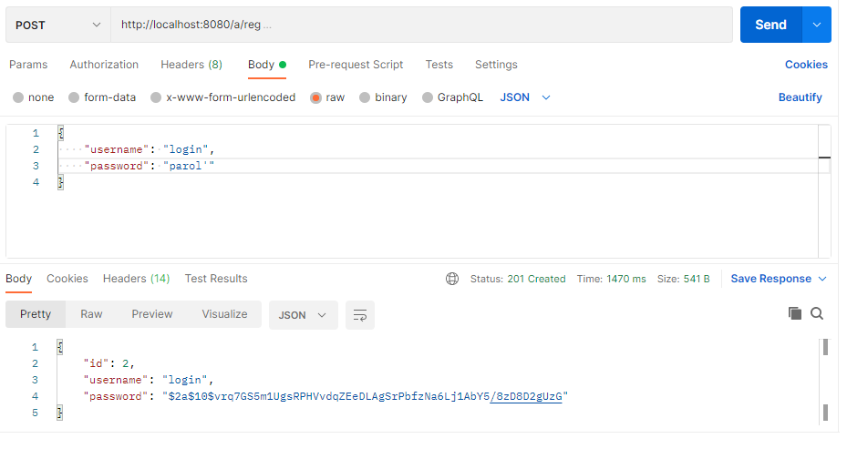
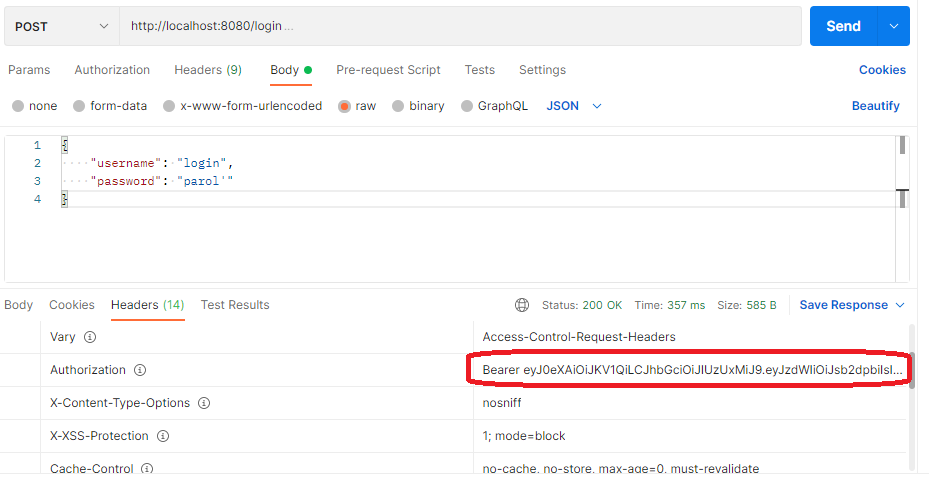
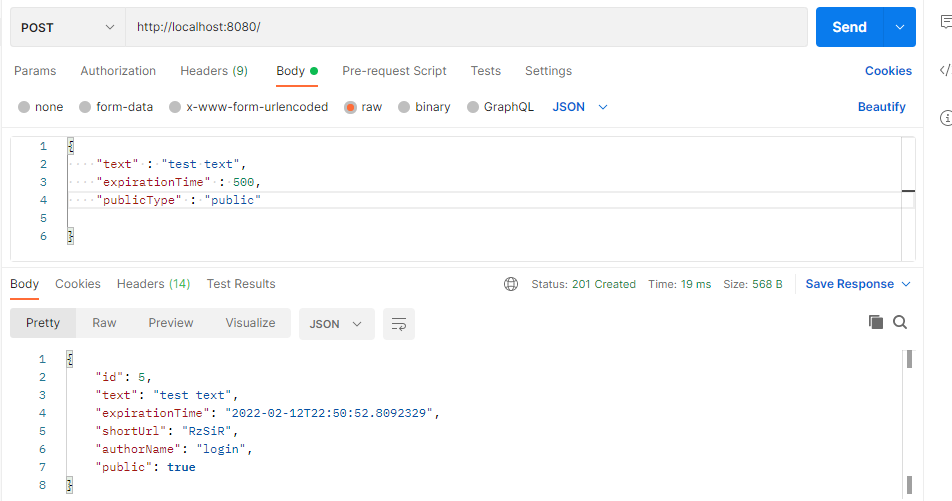
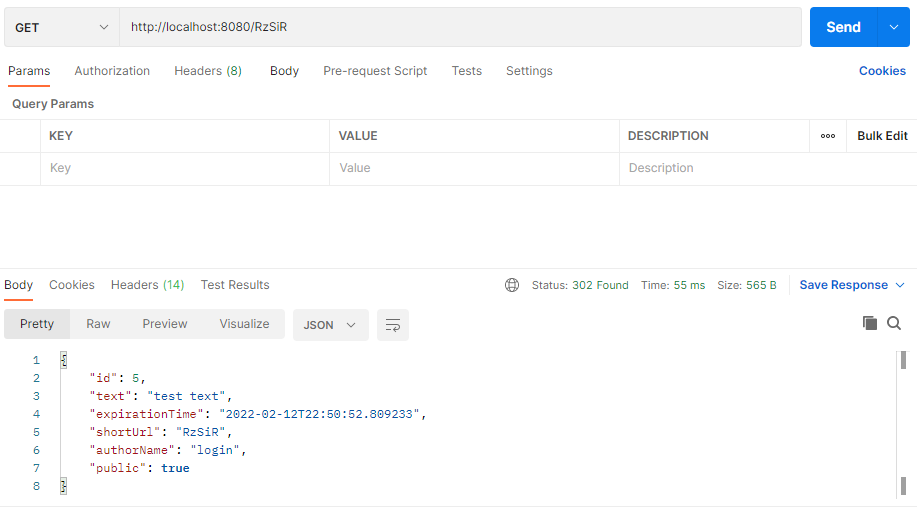
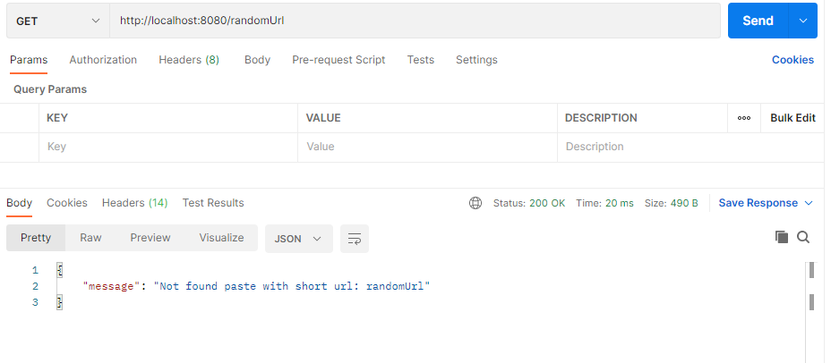
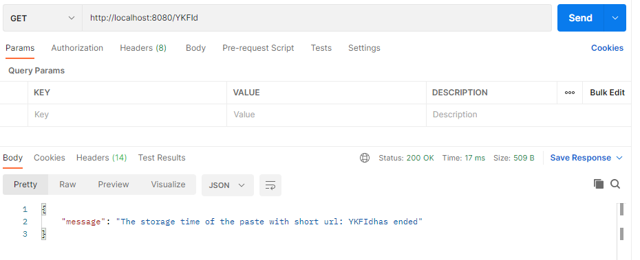

## My Pastebin

REST API сервис, аналогичный pastebin.com - позволяет отправлять некоторый текст ("пасту"), указав тип доступа и время размещения, и получить на него короткую ссылку, которую можно отправлять другим людям.

Использоване при разработке технологии:

- Java 11
- Spring Boot
- Spring Data JPA
- Spring Security
- JSON Web Token
- PostgreSQL
- Maven

***

Вначале владельцу сайта необходимо зарегистрироваться

POST: 
```
/a/reg
```


Затем, ему необходимо войти в систему, что бы получить JWT, который в последстии ему будет необходимо добавлять к каждому запросу в заголовок.

POST: 
```
/login
```


Так пользователю будет доступен весь функционал сервиса.

Чтобы отправить новую пасту, необходимо отправить POST-запрос в корень сервиса, в теле которого указать:
- Текст пасты
- Время в секундах, в течение которого она будет доступна
- Тип доступа (public или unpublic)

POST: 
```
/
```


Чтобы получить пасту из сервиса, нужно отправить GET-запрос, указав shortURL.

GET: 
```
/{shortUrl}
```


При этом, если обратиться к сервису по несуществующему shortURL, то произойдет исключительная ситуация. 


Так же, можно не получить в ответе пасту, если её время доступа закончилось.


Если пользователь хочет получить 10 последних паст, то он может отправить GET-запрос в корень сервиса. При этом, вернутся только те пасты, у которых тип ещё не истекло время размещения и тип доступа объявлен public.

GET: 
```
/{shortUrl}
```


